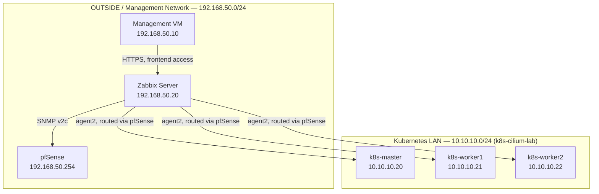

# zabbix-noc-lab

> A bare-metal Zabbix monitoring lab, built to observe an existing production-inspired Kubernetes networking environment.

This repository documents the design, deployment and validation of a Zabbix 7.0 LTS monitoring station, built without containers to demonstrate direct systems administration of the underlying services. The project focuses on Linux system administration, MySQL, SNMP monitoring and firewall segmentation, following the same structured, phase-by-phase implementation approach used in the author's previous lab.

The environment is being built incrementally, with each completed phase documented and validated before the next is introduced. This repository documents only capabilities that have been implemented and validated in the lab.

Unlike the author's previous lab, this repository documents planning rationale as a dedicated phase (`docs/phase-00-planning.md`), capturing *why* each architectural decision was made, not only *what* was built.

---

## Related Infrastructure

This lab monitors infrastructure provisioned in a separate portfolio project, [k8s-cilium-lab](https://github.com/paknaoo/k8s-cilium-lab) — a production-inspired Kubernetes networking environment built with VMware Workstation, pfSense and Cilium. `zabbix-noc-lab` is deliberately a standalone repository: it treats the existing lab as a fixed set of monitored endpoints rather than extending that project's scope.

| Host | IP address | Monitoring method |
|---|---|---|
| pfSense | `192.168.50.254` | SNMP v2c |
| k8s-master | `10.10.10.20` | Zabbix agent2 |
| k8s-worker1 | `10.10.10.21` | Zabbix agent2 |
| k8s-worker2 | `10.10.10.22` | Zabbix agent2 |
| mgmt | `192.168.50.10` | Zabbix agent2 |

---

## Architecture

The following diagram provides a high-level overview of the lab environment and its relationship to the existing Kubernetes networking lab.

    Loading

---

## Project Goals

The project is designed to build practical experience with monitoring and observability infrastructure while documenting each completed implementation phase.

- Deploy Zabbix 7.0 LTS on bare metal, without containers, to demonstrate direct systems administration.
- Configure MySQL as the Zabbix backend database.
- Monitor an existing Kubernetes lab and its network perimeter without modifying that lab's repository or scope.
- Design and validate firewall segmentation for monitoring traffic on pfSense, using least-privilege access rules.
- Practise Linux-based administration, including systemd, UFW and SSH hardening.
- Maintain concise, reproducible infrastructure documentation suitable for a technical portfolio.

---

## Technology Stack

The following technologies are used throughout the project.

| Category | Technology |
|---|---|
| Operating System | Ubuntu Server 24.04 LTS |
| Monitoring Platform | Zabbix 7.0 LTS |
| Database | MySQL |
| Web Server | Apache with PHP |
| Frontend Access | HTTPS with a self-signed certificate |
| Monitoring Protocols | SNMP v2c, Zabbix agent2 |
| Firewall | pfSense CE (perimeter), UFW (host-level) |
| Remote Administration | OpenSSH, key-based authentication only |
| Source Control | Git and GitHub |

---

## Implemented Components

The following components have been successfully deployed and validated so far.

- `zabbix-server` VM provisioned on Ubuntu Server 24.04 LTS in the OUTSIDE management network.
- SSH key-based authentication configured; password authentication disabled.
- UFW enabled as a host-level firewall, default deny incoming, SSH only.
- System time synchronised via `systemd-timesyncd`, correct local timezone set.

---

## Documentation

Implementation details are organised by project phase. Phases are listed in planned order; only completed phases are linked.

1. [Phase 00 — Planning](docs/phase-00-planning.md)
2. [Phase 01 — VM Provisioning and System Baseline](docs/phase-01-vm-provisioning.md)
3. Phase 02 — MySQL Installation and Configuration
4. Phase 03 — Zabbix Server Installation
5. Phase 04 — Frontend Configuration (Apache, PHP, HTTPS)
6. Phase 05 — SNMP Monitoring and pfSense Firewall Rules
7. Phase 06 — Zabbix Agent2 Deployment and Firewall Rules

The detailed current-state design is documented in:

- [Architecture](docs/architecture.md)

Validated troubleshooting cases are documented under:

- [SSH Password Authentication Overridden by cloud-init](docs/troubleshooting/ssh-password-auth-cloud-init-override.md)

---

## Validation

Validation is grouped by phase and updated as each phase is completed.

### Phase 01 — VM Provisioning and System Baseline

- `zabbix-server` reachable via SSH key-based authentication only; password authentication confirmed disabled.
- UFW reports `Status: active` with `22/tcp ALLOW IN` as the sole inbound rule.
- `systemd-timesyncd` reports `System clock synchronized: yes` and `NTP service: active`.
- System timezone confirmed set to `Europe/London`.

Further phases will be added here as they are completed.

---

## Project Status

This project is in progress. Phases 00 and 01 are complete; Phases 02–06 are planned and not yet implemented.

GitOps, alerting configuration and broader observability tooling are intentionally out of scope for this repository's initial build.

---

## Licence

This project is licensed under the MIT Licence. See the `LICENSE` file for details.
