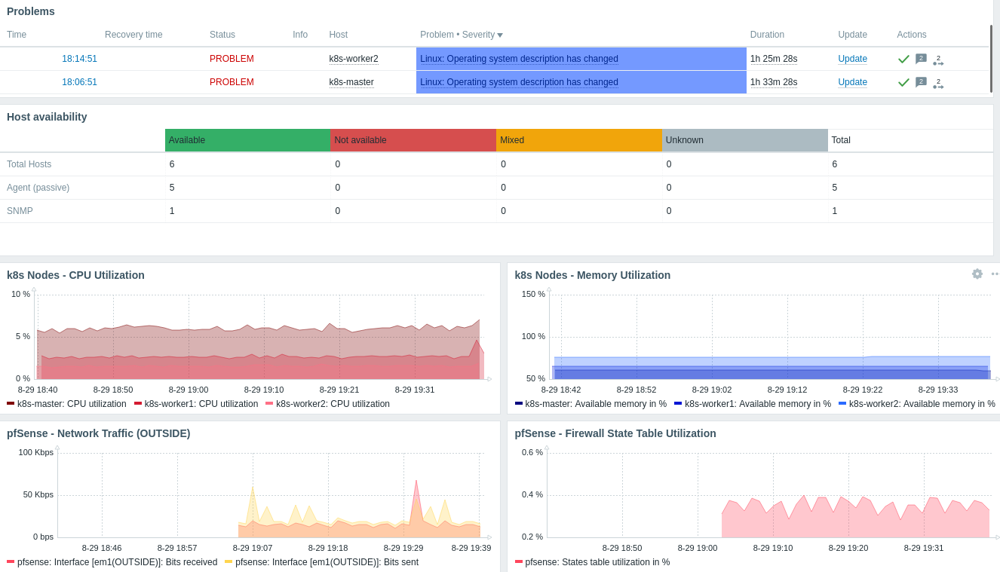
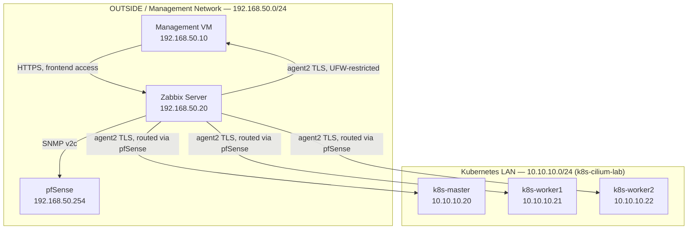

# zabbix-noc-lab

> A bare-metal Zabbix monitoring lab, built to observe an existing production-inspired Kubernetes networking environment.

This repository documents the design, deployment and validation of a Zabbix 7.0 LTS monitoring station, built without containers to demonstrate direct systems administration of the underlying services. The project focuses on Linux system administration, MySQL, SNMP monitoring and firewall segmentation, following the same structured, phase-by-phase implementation approach used in the author's previous lab.

The environment was built incrementally, with each phase documented and validated before the next was introduced. This repository documents only capabilities that have been implemented and validated in the lab. **The project has now reached functional completion**, covering the full scope originally planned in [Phase 00](docs/phase-00-planning.md).

Unlike the author's previous lab, this repository documents planning rationale as a dedicated phase (`docs/phase-00-planning.md`), capturing *why* each architectural decision was made, not only *what* was built.

---

## Related Infrastructure

This lab monitors infrastructure provisioned in a separate portfolio project, [k8s-cilium-lab](https://github.com/paknaoo/k8s-cilium-lab) — a production-inspired Kubernetes networking environment built with VMware Workstation, pfSense and Cilium. `zabbix-noc-lab` is deliberately a standalone repository: it treats the existing lab as a fixed set of monitored endpoints rather than extending that project's scope.

| Host | IP address | Monitoring method |
|---|---|---|
| pfSense | `192.168.50.254` | SNMP v2c |
| k8s-master | `10.10.10.20` | Zabbix agent2 |
| k8s-worker1 | `10.10.10.21` | Zabbix agent2 |
| k8s-worker2 | `10.10.10.22` | Zabbix agent2 |
| mgmt | `192.168.50.10` | Zabbix agent2 |

---

## Architecture

The following diagram provides a high-level overview of the lab environment and its relationship to the existing Kubernetes networking lab.

---

## Project Goals

The project is designed to build practical experience with monitoring and observability infrastructure while documenting each completed implementation phase.

- Deploy Zabbix 7.0 LTS on bare metal, without containers, to demonstrate direct systems administration.
- Configure MySQL as the Zabbix backend database.
- Monitor an existing Kubernetes lab and its network perimeter without modifying that lab's repository or scope.
- Design and validate firewall segmentation for monitoring traffic on pfSense, using least-privilege access rules.
- Practise Linux-based administration, including systemd, UFW and SSH hardening.
- Build a single-pane-of-glass NOC dashboard covering availability, performance and problem visibility.
- Encrypt monitoring traffic end-to-end using a self-managed PKI, rather than relying on a shared secret.
- Maintain concise, reproducible infrastructure documentation suitable for a technical portfolio.

---

## Technology Stack

The following technologies are used throughout the project.

| Category | Technology |
|---|---|
| Operating System | Ubuntu Server 24.04 LTS |
| Monitoring Platform | Zabbix 7.0.30 LTS |
| Database | MySQL 8.0.46 |
| Web Server | Apache 2.4.58 with PHP 8.3.6 (mod_php) |
| Frontend Access | HTTPS with a self-signed certificate |
| Monitoring Protocols | SNMP v2c, Zabbix agent2 (TLS, self-managed PKI) |
| Firewall | pfSense CE (perimeter), UFW (host-level) |
| Frontend Hardening | HTTP→HTTPS redirect, HSTS and security headers |
| Remote Administration | OpenSSH, key-based authentication only |
| Source Control | Git and GitHub |

---

## Implemented Components

The following components have been successfully deployed and validated so far.

- `zabbix-server` VM provisioned on Ubuntu Server 24.04 LTS in the OUTSIDE management network.
- SSH key-based authentication configured; password authentication disabled.
- UFW enabled as a host-level firewall, default deny incoming, SSH only.
- System time synchronised via `systemd-timesyncd`, correct local timezone set.
- MySQL installed and hardened, with a dedicated `zabbix` database and a least-privilege `zabbix@localhost` user.
- Zabbix Server 7.0 LTS installed, database schema imported, and connected to MySQL.
- Apache/PHP frontend served over HTTPS with a self-signed certificate, access restricted to `mgmt` via UFW.
- Default Zabbix Admin password changed from its installation default.
- SNMP v2c monitoring of pfSense configured and validated, with access restricted exclusively to `zabbix-server`.
- pfSense added as a Zabbix host (`Network Devices` group), actively reporting 12 monitored items.
- Zabbix agent2 deployed on all remaining hosts (`k8s-master`, `k8s-worker1`, `k8s-worker2`, `mgmt`) in passive mode; all now enabled and reporting in Zabbix.
- **All six planned hosts are actively monitored**, closing the project's main functional goal.
- A functional NOC-style dashboard (`NOC Overview`) with problems, host availability and key performance graphs.
- Trigger set tuned to this architecture: one inapplicable trigger (DHCP) disabled, informational OS-change triggers acknowledged rather than suppressed.
- Frontend hardened: HTTP forces a redirect to HTTPS, five security headers active (HSTS, X-Frame-Options, X-Content-Type-Options, Referrer-Policy, X-XSS-Protection).
- All Zabbix agent2 traffic encrypted with certificates from a lab-internal Certificate Authority; unencrypted connections actively rejected (confirmed by negative test).

---

## Documentation

Implementation details are organised by project phase. Phases are listed in planned order; only completed phases are linked.

1. [Phase 00 — Planning](docs/phase-00-planning.md)
2. [Phase 01 — VM Provisioning and System Baseline](docs/phase-01-vm-provisioning.md)
3. [Phase 02 — MySQL Installation and Configuration](docs/phase-02-mysql.md)
4. [Phase 03 — Zabbix Server, Apache and PHP Installation](docs/phase-03-zabbix-server-apache-php.md)
5. [Phase 04 — pfSense SNMP Monitoring](docs/phase-04-pfsense-snmp.md)
6. [Phase 05 — Zabbix Agent2 Deployment Across Monitored Hosts](docs/phase-05-agent2-nodes.md)
7. [Phase 06 — Triggers and NOC Dashboard](docs/phase-06-dashboards-triggers.md)
8. [Phase 07 — Security Hardening](docs/phase-07-hardening.md)

The detailed current-state design is documented in:

- [Architecture](docs/architecture.md)

Validated troubleshooting cases are documented under:

- [SSH Password Authentication Overridden by cloud-init](docs/troubleshooting/ssh-password-auth-cloud-init-override.md)
- [MySQL Binary Logging Blocks Zabbix Schema Import](docs/troubleshooting/mysql-binlog-schema-import-failure.md)
- [pfSense Broad Rule Leaking Access to Self-Targeted Traffic](docs/troubleshooting/pfsense-broad-rule-self-traffic-leak.md)
- [UFW Risk Assessment on Kubernetes Nodes](docs/troubleshooting/ufw-kubernetes-node-risk-assessment.md)
- [Missing ICMP Rule After Narrowing HOST_ZABBIX](docs/troubleshooting/missing-icmp-rule-after-firewall-narrowing.md)
- [False DHCP Alarm After pfSense Template Swap](docs/troubleshooting/pfsense-template-dhcp-false-alarm.md)
- [TLS Per-Host Encryption Setting Not Applied](docs/troubleshooting/tls-per-host-encryption-setting-not-applied.md)

---

## Validation

Validation is grouped by phase and updated as each phase is completed.

### Phase 01 — VM Provisioning and System Baseline

- `zabbix-server` reachable via SSH key-based authentication only; password authentication confirmed disabled.
- UFW reports `Status: active` with `22/tcp ALLOW IN` as the sole inbound rule.
- `systemd-timesyncd` reports `System clock synchronized: yes` and `NTP service: active`.
- System timezone confirmed set to `Europe/London`.

### Phase 02 — MySQL Installation and Configuration

- MySQL 8.0.46 installed; `systemctl status mysql` confirms `active (running)` and `enabled`.
- `mysql_secure_installation` completed: anonymous users removed, remote root login disabled, test database removed.
- `zabbix` database confirmed present with `utf8mb4` / `utf8mb4_bin` character set and collation.
- `zabbix@localhost` user confirmed via `SHOW GRANTS`: privileges limited to `GRANT ALL PRIVILEGES ON zabbix.*`, host scope restricted to `localhost` (not `%`).

### Phase 03 — Zabbix Server, Apache and PHP Installation

- `zabbix-server` (7.0.30), `zabbix-agent2` (7.0.30) and `apache2` (2.4.58) all confirmed `active (running)` and `enabled` via `systemctl status`.
- `zabbix-agent2` logs confirm successful configuration validation and clean startup.
- `sudo ufw status verbose` confirms `443/tcp ALLOW IN 192.168.50.10` only — not `Anywhere` — alongside the existing `22/tcp` rule from Phase 01.
- `curl -Ik https://192.168.50.20/` returns `HTTP/1.1 200 OK` with Zabbix's standard security headers and an `HttpOnly`/`secure` session cookie present.
- `php -v` confirms PHP 8.3.6; `date.timezone = Europe/London` confirmed present in `/etc/php/8.3/apache2/php.ini`.
- Default Zabbix Admin password changed from its installation default.
- Negative test (frontend access from a non-`mgmt` OUTSIDE host) not performed — no third host currently exists on that network segment; noted as a scope limitation rather than a configuration gap.

### Phase 04 — pfSense SNMP Monitoring

- `snmpwalk -v2c -c zbx-noc-r0 192.168.50.254 system` from `zabbix-server` returns full pfSense system data, confirming SNMP working end-to-end.
- Positive/negative test pair confirms least-privilege access: `zabbix-server` can query pfSense over SNMP; `mgmt` cannot (`Timeout: No Response`).
- A firewall rule leak was found via routine negative testing and fixed with an explicit Block rule — see [pfSense Broad Rule Leaking Access to Self-Targeted Traffic](docs/troubleshooting/pfsense-broad-rule-self-traffic-leak.md).
- Host `pfsense` confirmed in Zabbix's Latest data view with 12 active items reporting, tagged by component (health/network/system).

### Phase 05 — Zabbix Agent2 Deployment Across Monitored Hosts

- `zabbix_get -k agent.ping` from `zabbix-server` returns `1` for `k8s-master`, `k8s-worker1`, `k8s-worker2` and `mgmt`.
- An out-of-scope `zabbix_get` run from `k8s-master` itself correctly returned an access-permission error, confirming passive-mode source-IP restriction works as intended.
- Zabbix Hosts view confirms `Displaying 6 of 6 found`, all hosts `Enabled`.
- `sudo ufw status verbose` on `mgmt` confirms only WireGuard (`56666/udp`) and agent2 polling from `192.168.50.20` are permitted inbound.
- `ping -c 4 192.168.50.254` from `zabbix-server` confirms 0% packet loss after the ICMP rule fix, and the corresponding Zabbix trigger cleared automatically.
- UFW confirmed `inactive` on `k8s-master` following the Phase 05 risk assessment — a deliberate end state, not an oversight.

### Phase 06 — Triggers and NOC Dashboard

- `NOC Overview` dashboard confirmed live with 6 widgets: Problems, Host availability, and four performance graphs.
- Host availability widget confirms 6/6 hosts `Available`, zero `Not available`/`Mixed`/`Unknown`.
- `pfsense` host template confirmed swapped to "pfSense by SNMP"; new throughput and firewall state table items confirmed populated on the dashboard graphs.
- False "DHCP server is not running" trigger confirmed disabled at the host level, with reasoning documented.
- Both remaining Warning problems (OS description changed) confirmed acknowledged with an explanatory comment; zero unaddressed problems at phase close.

### Phase 07 — Security Hardening

- `curl -Ik http://192.168.50.20` confirms `301 Moved Permanently` with a `Location` header pointing to HTTPS.
- `curl -Ik https://192.168.50.20 --insecure` confirms all five configured security headers present in the response.
- Final PKI directory listing on `zabbix-server` confirms the CA, server certificate/key, and only the four agents' *public* certificates remain — no agent private keys.
- `zabbix_get --tls-connect cert` (with correct CA/cert/key paths) returns `1` for all four agent2 hosts (`k8s-master`, `k8s-worker1`, `k8s-worker2`, `mgmt`).
- Negative test: `zabbix_get` without TLS flags against `k8s-master` returns `Connection reset by peer`, confirming unencrypted connections are actively rejected, not merely one of two accepted options.

Further phases will be added here as they are completed.

---

## Project Status

This project is **functionally complete**. Phases 00–07 cover the full scope originally planned: every host is monitored, a NOC dashboard with a tuned trigger set is live, and the frontend and agent2 traffic are both hardened (HTTPS with security headers, and TLS with a self-managed PKI, respectively).

Two pieces of work stand out as the strongest evidence of the methodology used throughout this project:

- **[pfSense Broad Rule Leaking Access to Self-Targeted Traffic](docs/troubleshooting/pfsense-broad-rule-self-traffic-leak.md)** (Phase 04) — a firewall access leak found purely through routine negative testing, diagnosed via pfSense's rule-ordering behaviour, and fixed with a minimal, scope-respecting change.
- **[Phase 07 — Security Hardening](docs/phase-07-hardening.md)** — a self-managed Certificate Authority issuing and managing certificates for all monitored hosts, chosen deliberately over the simpler PSK option to demonstrate broader certificate-management skills.

Alerting (email/webhook notifications) remains deliberately out of scope, per the original Phase 00 plan.

---

## Licence

This project is licensed under the MIT Licence. See the `LICENSE` file for details.
