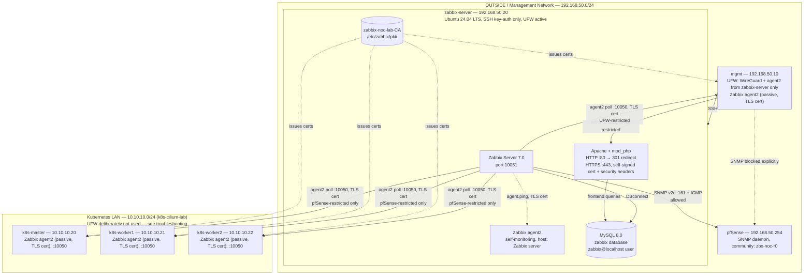
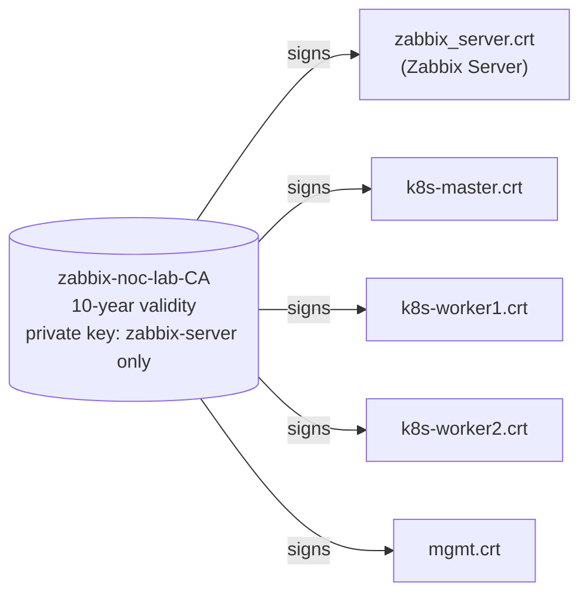

# Architecture

This document describes the current-state design of `zabbix-noc-lab`. It is updated after each phase is completed and validated; it reflects what has actually been built, not the full end-state plan (see the [README](../README.md#documentation) for the phase roadmap).

**Current state: Phase 07 complete. The project is functionally complete**, covering the full scope originally planned in Phase 00. Every host is monitored, a NOC dashboard with a tuned trigger set is live, the frontend enforces HTTPS with security headers, and all agent2 traffic is encrypted with certificates from a lab-internal CA. Alerting (notifications) remains deliberately out of scope, per the original Phase 00 plan.

---

## Network Layout

| Network | CIDR | Role |
|---|---|---|
| OUTSIDE / management | `192.168.50.0/24` | Hosts `mgmt` and `zabbix-server`; routed by pfSense |
| Kubernetes LAN | `10.10.10.0/24` | Hosts the `k8s-cilium-lab` cluster nodes; external to this repository |

`zabbix-server` was deliberately placed in the OUTSIDE network rather than alongside the Kubernetes nodes it monitors, so that all monitoring traffic to the Kubernetes LAN must be explicitly routed and permitted through pfSense. See [Phase 00 — Planning](phase-00-planning.md) for the full rationale.

---

## Current Components

Every planned host is now monitored. `zabbix-server` polls the three Kubernetes nodes and `mgmt` over Zabbix agent2 (passive mode — Zabbix Server initiates each connection), and polls pfSense over SNMP v2c. `zabbix-agent2` on `zabbix-server` itself continues to self-report under the default "Zabbix server" host created by the installation wizard.

**Internet egress:** `zabbix-server` routes outbound traffic directly through NAT on pfSense (`HOST_ZABBIX → Any`, now narrowed — see below), rather than through the WireGuard full-tunnel used by `mgmt`. This is a deliberate role separation, confirmed during Phase 02 — see [Phase 00 — Planning](phase-00-planning.md#internet-egress-path-direct-nat-vs-wireguard) for the full rationale.

**Agent2 connection model:** all agent2 hosts use **passive mode** — Zabbix Server initiates the connection on port 10050, rather than agents connecting out to the server. This keeps firewall control centralised at a single source (`HOST_ZABBIX`), consistent with the project's broader access-control pattern. See [Phase 00 — Planning](phase-00-planning.md#retrospective-note-passive-agent2-mode-and-its-firewall-implications-added-after-phase-05) for the full rationale.

---

## Access Filtering: pfSense vs UFW

`zabbix-noc-lab` uses two distinct layers of access filtering, applied at different points in the network:

| Filtering point | Applies to | Example |
|---|---|---|
| **pfSense** (perimeter firewall) | Traffic crossing between network segments, and traffic destined for pfSense itself | `zabbix-server` → pfSense SNMP/ICMP; `zabbix-server` → Kubernetes LAN agent2 polling |
| **UFW** (host-based firewall) | Traffic within the same network segment, destined for a monitored host — where enabling it does not risk an unrelated system's availability | `mgmt` → `zabbix-server` frontend, port 443; `zabbix-server` → `mgmt` agent2 polling |

`mgmt` and `zabbix-server` both sit in the same OUTSIDE segment (`192.168.50.0/24`), so traffic between them is never routed through pfSense — the Phase 03 frontend restriction and the Phase 05 `mgmt` agent2 restriction are both implemented at the UFW level. Traffic destined for pfSense itself, or for the Kubernetes LAN, is filtered on pfSense instead, since pfSense sits on the path for that traffic.

### UFW Asymmetry: Present on `zabbix-server` / `mgmt`, Deliberately Absent on Kubernetes Nodes

UFW is active on `zabbix-server` and `mgmt`, but **deliberately left disabled** on `k8s-master`, `k8s-worker1` and `k8s-worker2`. This is not an inconsistency: it reflects a considered decision, made after a near-incident during Phase 05 in which briefly enabling UFW on `k8s-master` risked blocking critical, unfamiliar cluster ports (`kube-apiserver`, `etcd`, Cilium's VXLAN and health-check ports). The Kubernetes nodes belong to a separate project (`k8s-cilium-lab`) with an already-established security architecture (Cilium NetworkPolicies), and access to Zabbix's port 10050 on those nodes is instead secured entirely at the pfSense level. Full details, including the incident itself and the risk assessment behind the final decision, are in [Troubleshooting: UFW Risk Assessment on Kubernetes Nodes](troubleshooting/ufw-kubernetes-node-risk-assessment.md).

**Rule ordering matters.** Phase 04 uncovered a case where a broad, pre-existing pfSense rule (`HOST_MGMT → Any`, inherited from `k8s-cilium-lab`) unintentionally matched traffic destined for pfSense's own SNMP daemon. Phase 05 then uncovered the mirror-image lesson while narrowing the equivalent `HOST_ZABBIX → Any` rule: the new, narrower rule initially omitted ICMP, which a Zabbix template relied on implicitly. See [pfSense Broad Rule Leaking Access to Self-Targeted Traffic](troubleshooting/pfsense-broad-rule-self-traffic-leak.md) and [Missing ICMP Rule After Narrowing HOST_ZABBIX](troubleshooting/missing-icmp-rule-after-firewall-narrowing.md).

### Negative Testing as Standard Practice

Every access restriction documented in this repository is confirmed with two tests: a **positive test** (the intended host can reach the service) and a **negative test** (a host outside the intended scope cannot). The Phase 04 firewall leak was found exclusively because this negative test was run as a matter of routine — not in response to a suspected problem. This methodology is applied consistently from Phase 03 onward and is treated as a required step, not an optional check.

---

## pfSense OUTSIDE Interface — Firewall Rules (current state)

| # | Source | Protocol | Destination | Port | Action | Description |
|---|---|---|---|---|---|---|
| 1 | `HOST_MGMT` | UDP | This Firewall | WireGuard | Pass | Allow HOST_MGMT WireGuard to pfSense *(k8s-cilium-lab)* |
| 2 | `HOST_MGMT` | TCP | This Firewall | 443 (HTTPS) | Pass | Allow mgmt WebGUI to pfSense *(k8s-cilium-lab)* |
| 3 | `HOST_MGMT` | ICMP | This Firewall | any | Pass | Allow mgmt ICMP to pfSense *(k8s-cilium-lab)* |
| 4 | `HOST_MGMT` | TCP | `GRP_K8S_NODES` | SSH | Pass | Allow HOST_MGMT SSH to Kubernetes nodes *(k8s-cilium-lab)* |
| 5 | `HOST_MGMT` | TCP | `HOST_MASTER` | K8s API | Pass | Allow HOST_MGMT to Kubernetes API *(k8s-cilium-lab)* |
| 6 | `HOST_MGMT` | UDP | This Firewall | 161 (SNMP) | **Block** | Block mgmt access to pfSense SNMP — explicit exclusion, `zabbix-noc-lab` Phase 04 |
| 7 | `HOST_MGMT` | * | * | * | Pass | Allow HOST_MGMT outbound *(k8s-cilium-lab)* |
| 8 | `HOST_ZABBIX` | TCP/UDP | any | 80, 443, 53 | Pass | Zabbix server internet access (apt, package repos, DNS) |
| 9 | `HOST_ZABBIX` | TCP | `GRP_K8S_NODES` | 10050 | Pass | Zabbix server agent2 polling — k8s nodes |
| 10 | `HOST_ZABBIX` | UDP | This Firewall | 161 (SNMP) | Pass | Allow SNMP from zabbix-server to pfSense |
| 11 | `HOST_ZABBIX` | ICMP | This Firewall | any | Pass | Allow ICMP from zabbix-server to pfSense (SNMP host availability check) |

Rules 1–5 and 7 predate this repository and belong to `k8s-cilium-lab`'s architecture; they are listed here only because their ordering directly affects rule 6. Rules 6 and 8–11 were added or modified as part of `zabbix-noc-lab`. Rule 8 replaces a formerly broad `HOST_ZABBIX * → * : *` rule, narrowed in Phase 05.

---

## Monitored Hosts (Zabbix)

| Host (in Zabbix) | Monitoring method | Host group | Template | Status |
|---|---|---|---|---|
| `pfsense` | SNMP v2c, community `zbx-noc-r0` | Network Devices | pfSense by SNMP | Enabled, 1 trigger deliberately disabled (DHCP — see [troubleshooting](troubleshooting/pfsense-template-dhcp-false-alarm.md)) |
| `k8s-master` | Zabbix agent2 (passive), `10.10.10.20:10050` | Kubernetes Nodes | Linux by Zabbix agent | Enabled |
| `k8s-worker1` | Zabbix agent2 (passive), `10.10.10.21:10050` | Kubernetes Nodes | Linux by Zabbix agent | Enabled |
| `k8s-worker2` | Zabbix agent2 (passive), `10.10.10.22:10050` | Kubernetes Nodes | Linux by Zabbix agent | Enabled |
| `mgmt` | Zabbix agent2 (passive), `192.168.50.10:10050` | Management | Linux by Zabbix agent | Enabled |
| Zabbix server *(default, auto-created)* | Zabbix agent2 (local), `127.0.0.1:10050` | Zabbix servers | *(default installer template)* | Enabled |

All six planned hosts are enabled and reporting — confirmed via the Zabbix Hosts view (`Displaying 6 of 6 found`). Both previously-open Warning-level triggers (`k8s-master`, `Zabbix server` — OS description changed) have been acknowledged, with a comment explaining the expected cause, rather than disabled — this preserves the trigger's ability to flag a genuinely *unexpected* future OS change as a possible security signal.

---

## Monitoring Dashboard

A single dashboard, **`NOC Overview`**, provides a top-to-bottom, general-to-specific view of the environment:

1. **Problems** — recent problems across all hosts, sorted by severity
2. **Host availability** — aggregate availability by interface type (agent, SNMP)
3. **k8s Nodes — CPU Utilization** and **Memory Utilization** — side by side, all three nodes on each chart
4. **pfSense — Network Traffic (OUTSIDE)** and **Firewall State Table Utilization** — side by side

The pfSense throughput and firewall state table metrics became available only after replacing the `pfsense` host's template with **"pfSense by SNMP"** (see [Phase 06](phase-06-dashboards-triggers.md) for the full reasoning) — the previously-assigned "Generic by SNMP" template had no Low-Level Discovery rule for network interfaces. This template swap also surfaced one trigger not applicable to this architecture (DHCP server availability), which was deliberately disabled since this lab uses static IP addressing throughout — see [Troubleshooting: False DHCP Alarm After pfSense Template Swap](troubleshooting/pfsense-template-dhcp-false-alarm.md).

No custom triggers were added beyond those provided by the official assigned templates ("pfSense by SNMP", "Linux by Zabbix agent") — a deliberate decision, since the existing set already covers availability, performance, configuration drift and host-restart scenarios for every monitored host.

---

## Security Hardening

### Frontend

- **HTTP → HTTPS redirect:** the port-80 VirtualHost issues a `301 Moved Permanently` to HTTPS for all requests, using `%{HTTP_HOST}` rather than a hardcoded hostname so the redirect works whether the frontend is reached by hostname or IP.
- **Security headers:** `Strict-Transport-Security`, `X-Frame-Options`, `X-Content-Type-Options`, `Referrer-Policy` and `X-XSS-Protection` are set at the Apache level, in addition to headers the Zabbix frontend already sets independently at the application layer — a small, deliberate example of layered defence rather than relying on a single source of protection.

### Agent2 Encryption (Self-Managed PKI)

All Zabbix agent2 traffic between `zabbix-server` and its four monitored agent hosts (`k8s-master`, `k8s-worker1`, `k8s-worker2`, `mgmt`) is encrypted and certificate-authenticated, using a lab-internal Certificate Authority rather than Zabbix's simpler PSK option — chosen deliberately to demonstrate certificate lifecycle management (CA creation, CSR signing, distribution, cleanup) over the lighter-weight alternative.

Each host's `TLSConnect`/`TLSAccept` is set to `cert`, and the Zabbix UI's per-host Encryption setting ("Connections to host") is set to Certificate for each monitored host — both layers are required together; see [Troubleshooting: TLS Per-Host Encryption Setting Not Applied](troubleshooting/tls-per-host-encryption-setting-not-applied.md) for what happens when only one is configured.

**PKI hygiene:** once all four agents were confirmed working, their private keys were deleted from `zabbix-server`, leaving only the CA's own key/certificate, the server's own key/certificate, and the agents' *public* certificates (harmless to retain, useful for reference). This reflects standard CA practice: a CA signs certificates for the entities it serves, but does not retain their private keys.

A negative test (an unencrypted `zabbix_get`, with no TLS flags) confirms agents actively reject plaintext connections rather than merely tolerating both encrypted and unencrypted traffic — consistent with this repository's negative-testing standard applied throughout.

---

## Firewall Summary

| Layer | Current state |
|---|---|
| pfSense (perimeter) | See the full OUTSIDE interface rule table above |
| UFW (`zabbix-server`) | Default deny incoming; `22/tcp` allowed; `443/tcp` allowed from `192.168.50.10` (mgmt) only |
| UFW (`mgmt`) | Default deny incoming; `56666/udp` (WireGuard) allowed; `10050/tcp` allowed from `192.168.50.20` (zabbix-server) only |
| UFW (Kubernetes nodes) | Deliberately disabled — see [UFW Risk Assessment on Kubernetes Nodes](troubleshooting/ufw-kubernetes-node-risk-assessment.md) |
