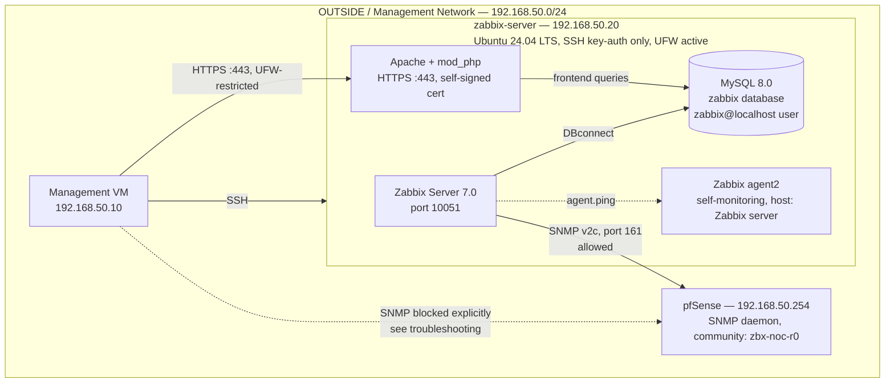

# Architecture

This document describes the current-state design of `zabbix-noc-lab`. It is updated after each phase is completed and validated; it reflects what has actually been built, not the full end-state plan (see the [README](../README.md#documentation) for the phase roadmap).

**Current state: Phase 04 complete.** Zabbix Server, MySQL, the Apache/PHP frontend, and SNMP monitoring of pfSense are all deployed and validated. Monitoring of the Kubernetes nodes and `mgmt` via agent2 is not yet configured.

---

## Network Layout

| Network | CIDR | Role |
|---|---|---|
| OUTSIDE / management | `192.168.50.0/24` | Hosts `mgmt` and `zabbix-server`; routed by pfSense |
| Kubernetes LAN | `10.10.10.0/24` | Hosts the `k8s-cilium-lab` cluster nodes; external to this repository |

`zabbix-server` was deliberately placed in the OUTSIDE network rather than alongside the Kubernetes nodes it monitors, so that all monitoring traffic to the Kubernetes LAN must be explicitly routed and permitted through pfSense. See [Phase 00 — Planning](phase-00-planning.md) for the full rationale.

---

## Current Components

At this stage, `zabbix-server` runs Zabbix Server 7.0, MySQL, and an Apache/PHP frontend served over HTTPS. It actively polls pfSense over SNMP v2c and has pfSense registered as a monitored host (`pfsense`, host group `Network Devices`). `zabbix-agent2` on `zabbix-server` itself is already reporting data under the default "Zabbix server" host created by the installation wizard, ahead of its formal planned configuration in Phase 05. No connectivity to the Kubernetes nodes has been configured yet.

**Internet egress:** `zabbix-server` routes outbound traffic directly through NAT on pfSense (`HOST_ZABBIX → Any`), rather than through the WireGuard full-tunnel used by `mgmt`. This is a deliberate role separation, confirmed during Phase 02 — see [Phase 00 — Planning](phase-00-planning.md#internet-egress-path-direct-nat-vs-wireguard) for the full rationale.

---

## Access Filtering: pfSense vs UFW

`zabbix-noc-lab` uses two distinct layers of access filtering, applied at different points in the network:

| Filtering point | Applies to | Example |
|---|---|---|
| **pfSense** (perimeter firewall) | Traffic crossing between network segments, and traffic destined for pfSense itself | `zabbix-server` → pfSense SNMP (this phase); `zabbix-server` → Kubernetes LAN (agent2, Phase 05) |
| **UFW** (host-based firewall) | Traffic within the same network segment, destined for a monitored host | `mgmt` → `zabbix-server` frontend, port 443 |

`mgmt` and `zabbix-server` both sit in the same OUTSIDE segment (`192.168.50.0/24`), so traffic between them is never routed through pfSense — the Phase 03 frontend restriction to `mgmt` is implemented entirely at the UFW level. Traffic destined for pfSense itself, or for the Kubernetes LAN, is filtered on pfSense instead, since pfSense sits on the path for that traffic.

**Rule ordering matters.** Phase 04 uncovered a case where a broad, pre-existing pfSense rule (`HOST_MGMT → Any`, inherited from `k8s-cilium-lab`) unintentionally matched traffic destined for pfSense's own SNMP daemon, because pfSense evaluates rules top-to-bottom and `Destination: *` includes "This Firewall (self)". See [Troubleshooting: pfSense Broad Rule Leaking Access to Self-Targeted Traffic](troubleshooting/pfsense-broad-rule-self-traffic-leak.md) for the full investigation.

### Negative Testing as Standard Practice

Every access restriction documented in this repository is confirmed with two tests: a **positive test** (the intended host can reach the service) and a **negative test** (a host outside the intended scope cannot). The Phase 04 firewall leak above was found exclusively because this negative test was run as a matter of routine — not in response to a suspected problem. This methodology is applied consistently from Phase 03 onward and is treated as a required step, not an optional check.

---

## pfSense OUTSIDE Interface — Firewall Rules (current state)

| # | Source | Protocol | Destination | Port | Action | Description |
|---|---|---|---|---|---|---|
| 1 | `HOST_MGMT` | UDP | This Firewall | WireGuard | Pass | Allow HOST_MGMT WireGuard to pfSense *(k8s-cilium-lab)* |
| 2 | `HOST_MGMT` | TCP | This Firewall | 443 (HTTPS) | Pass | Allow mgmt WebGUI to pfSense *(k8s-cilium-lab)* |
| 3 | `HOST_MGMT` | ICMP | This Firewall | any | Pass | Allow mgmt ICMP to pfSense *(k8s-cilium-lab)* |
| 4 | `HOST_MGMT` | TCP | `GRP_K8S_NODES` | SSH | Pass | Allow HOST_MGMT SSH to Kubernetes nodes *(k8s-cilium-lab)* |
| 5 | `HOST_MGMT` | TCP | `HOST_MASTER` | K8s API | Pass | Allow HOST_MGMT to Kubernetes API *(k8s-cilium-lab)* |
| 6 | `HOST_MGMT` | UDP | This Firewall | 161 (SNMP) | **Block** | Block mgmt access to pfSense SNMP — explicit exclusion, `zabbix-noc-lab` Phase 04 |
| 7 | `HOST_MGMT` | * | * | * | Pass | Allow HOST_MGMT outbound *(k8s-cilium-lab)* |
| 8 | `HOST_ZABBIX` | * | * | * | Pass | Allow HOST_ZABBIX outbound |
| 9 | `HOST_ZABBIX` | UDP | This Firewall | 161 (SNMP) | Pass | Allow SNMP from zabbix-server to pfSense |

Rules 1–5 and 7 predate this repository and belong to `k8s-cilium-lab`'s architecture; they are listed here only because their ordering directly affects how rule 6 was found to be necessary. Rules 6, 8 and 9 were added as part of `zabbix-noc-lab`.

---

## Monitored Hosts (Zabbix)

| Host (in Zabbix) | Monitoring method | Host group | Template | Status |
|---|---|---|---|---|
| `pfsense` | SNMP v2c, community `zbx-noc-r0` | Network Devices | Generic by SNMP | 12 items active, confirmed in Latest data |
| Zabbix server *(default, auto-created)* | Zabbix agent2 (local) | Zabbix servers | *(default installer template)* | Already reporting; first informational problem raised (package count change) |

Kubernetes nodes (`k8s-master`, `k8s-worker1`, `k8s-worker2`) and `mgmt` are not yet added — planned for Phase 05.

---

## Planned Components

The following will be added to this document as each phase is completed:

- Zabbix agent2 monitoring of the Kubernetes nodes, `mgmt`, and formal configuration of the `zabbix-server` self-monitoring host, with a dedicated pfSense firewall rule (Phase 05)

---

## Firewall Summary

| Layer | Current state |
|---|---|
| pfSense (perimeter) | See the full OUTSIDE interface rule table above |
| UFW (host) | Default deny incoming; `22/tcp` allowed; `443/tcp` allowed from `192.168.50.10` (mgmt) only |

Further pfSense rules (agent2 to the Kubernetes LAN) will be added and documented here as Phase 05 is completed.
