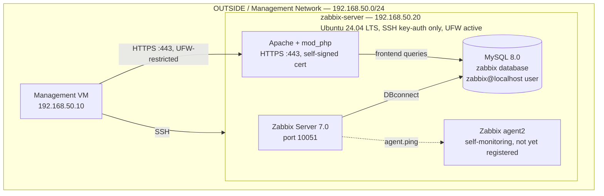

# Architecture

This document describes the current-state design of `zabbix-noc-lab`. It is updated after each phase is completed and validated; it reflects what has actually been built, not the full end-state plan (see the [README](../README.md#documentation) for the phase roadmap).

**Current state: Phase 03 complete.** Zabbix Server, MySQL, and the Apache/PHP frontend over HTTPS are all deployed and running on `zabbix-server`. Monitoring connectivity to pfSense and the Kubernetes nodes is not yet configured.

---

## Network Layout

| Network | CIDR | Role |
|---|---|---|
| OUTSIDE / management | `192.168.50.0/24` | Hosts `mgmt` and `zabbix-server`; routed by pfSense |
| Kubernetes LAN | `10.10.10.0/24` | Hosts the `k8s-cilium-lab` cluster nodes; external to this repository |

`zabbix-server` was deliberately placed in the OUTSIDE network rather than alongside the Kubernetes nodes it monitors, so that all monitoring traffic to the Kubernetes LAN must be explicitly routed and permitted through pfSense. See [Phase 00 — Planning](phase-00-planning.md) for the full rationale.

---

## Current Components

At this stage, `zabbix-server` runs Zabbix Server 7.0, MySQL, and an Apache/PHP frontend served over HTTPS with a self-signed certificate. `zabbix-agent2` is installed for self-monitoring but not yet formally registered as a monitored host in the Zabbix frontend — that happens in Phase 05, alongside the rest of the fleet. No connectivity to pfSense (SNMP) or the Kubernetes nodes (agent2) has been configured yet.

**Internet egress:** `zabbix-server` routes outbound traffic directly through NAT on pfSense (`HOST_ZABBIX → Any`), rather than through the WireGuard full-tunnel used by `mgmt`. This is a deliberate role separation, confirmed during Phase 02 — see [Phase 00 — Planning](phase-00-planning.md#internet-egress-path-direct-nat-vs-wireguard) for the full rationale.

---

## Access Filtering: pfSense vs UFW

`zabbix-noc-lab` uses two distinct layers of access filtering, applied at different points in the network:

| Filtering point | Applies to | Example |
|---|---|---|
| **pfSense** (perimeter firewall) | Traffic crossing between network segments (routed traffic) | `zabbix-server` → Kubernetes LAN (agent2, Phase 05); `zabbix-server` → pfSense SNMP (Phase 04) |
| **UFW** (host-based firewall) | Traffic within the same network segment (not routed) | `mgmt` → `zabbix-server` frontend, port 443 |

`mgmt` and `zabbix-server` both sit in the same OUTSIDE segment (`192.168.50.0/24`), so traffic between them is never routed through pfSense — a pfSense rule restricting frontend access would have no effect on this traffic. The Phase 03 frontend restriction to `mgmt` is therefore implemented entirely at the UFW level. Restrictions on traffic that *does* cross into the Kubernetes LAN — SNMP to pfSense and agent2 to the cluster nodes — are implemented on pfSense instead, since that traffic is routed.

---

## Planned Components

The following will be added to this document as each phase is completed:

- SNMP monitoring of pfSense, with a dedicated pfSense firewall rule (Phase 04)
- Zabbix agent2 monitoring of the Kubernetes nodes, `mgmt`, and `zabbix-server` itself, with a dedicated pfSense firewall rule (Phase 05)

---

## Firewall Summary

| Layer | Current state |
|---|---|
| pfSense (perimeter) | `HOST_ZABBIX → Any` (outbound only, for package installation) |
| UFW (host) | Default deny incoming; `22/tcp` allowed; `443/tcp` allowed from `192.168.50.10` (mgmt) only |

Further pfSense rules (SNMP, agent2) will be added and documented here as Phases 04 and 05 are completed.
