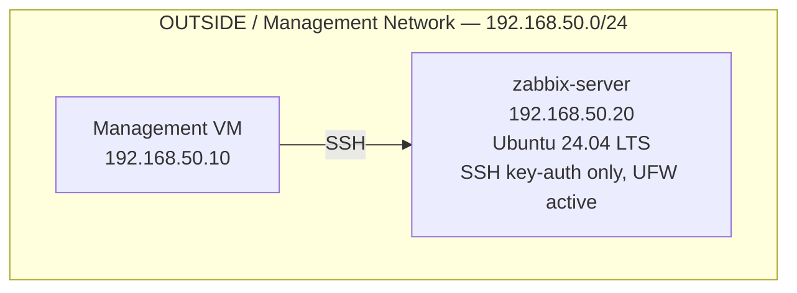

# Architecture

This document describes the current-state design of `zabbix-noc-lab`. It is updated after each phase is completed and validated; it reflects what has actually been built, not the full end-state plan (see the [README](../README.md#documentation) for the phase roadmap).

**Current state: Phase 01 complete.** MySQL, Zabbix server, the frontend, and monitoring connectivity are not yet deployed.

---

## Network Layout

| Network | CIDR | Role |
|---|---|---|
| OUTSIDE / management | `192.168.50.0/24` | Hosts `mgmt` and `zabbix-server`; routed by pfSense |
| Kubernetes LAN | `10.10.10.0/24` | Hosts the `k8s-cilium-lab` cluster nodes; external to this repository |

`zabbix-server` was deliberately placed in the OUTSIDE network rather than alongside the Kubernetes nodes it monitors, so that all monitoring traffic to the Kubernetes LAN must be explicitly routed and permitted through pfSense. See [Phase 00 — Planning](phase-00-planning.md) for the full rationale.

---

## Current Components

At this stage, `zabbix-server` exists as a hardened, updated, time-synchronised Ubuntu 24.04 LTS host with no monitoring software installed yet.

---

## Planned Components

The following will be added to this document as each phase is completed:

- MySQL database backend (Phase 02)
- Zabbix Server 7.0 LTS (Phase 03)
- Apache/PHP frontend over HTTPS, restricted to `mgmt` (Phase 04)
- SNMP monitoring of pfSense, with a dedicated pfSense firewall rule (Phase 05)
- Zabbix agent2 monitoring of the Kubernetes nodes and `mgmt`, with a dedicated pfSense firewall rule (Phase 06)

---

## Firewall Summary

| Layer | Current state |
|---|---|
| pfSense (perimeter) | `HOST_ZABBIX → Any` (outbound only, for package installation) |
| UFW (host) | Default deny incoming; `22/tcp` allowed |

Further pfSense rules (SNMP, agent2) will be added and documented here as Phases 05 and 06 are completed.
