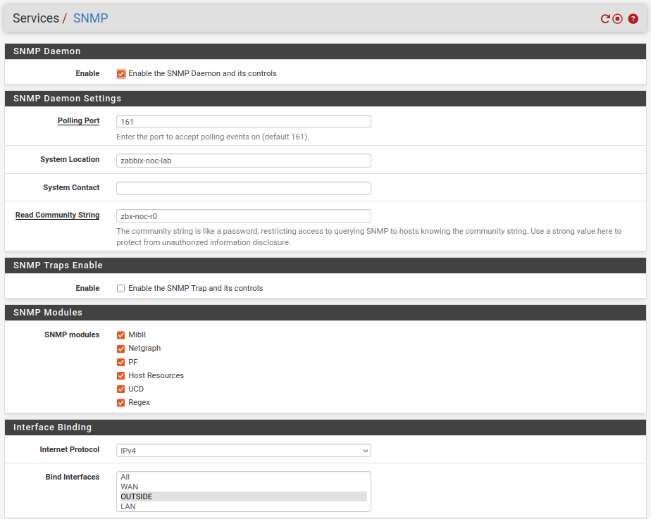
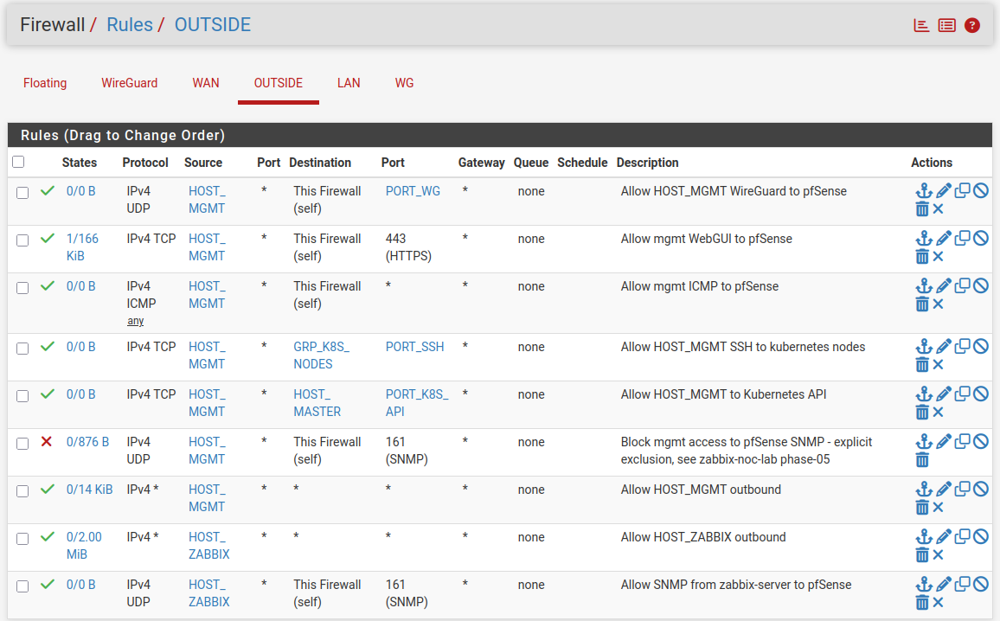
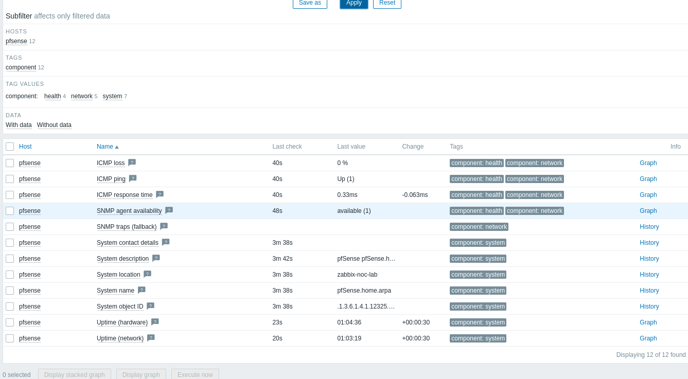

# Phase 04 — pfSense SNMP Monitoring

This phase covers enabling SNMP monitoring of pfSense, installing the SNMP client and MIBs on `zabbix-server`, adding pfSense as a monitored host in Zabbix, and — critically — discovering and fixing an unintended firewall rule interaction found while running the standard negative-test methodology used throughout this project.

---

## SNMP Configuration on pfSense

Configured under **Services → SNMP**:



| Setting | Value |
|---|---|
| SNMP Daemon | Enabled |
| SNMP Trap | Disabled |
| Polling Port | 161 (default) |
| System Location | `zabbix-noc-lab` |
| Read Community String | `zbx-noc-r0` (deliberately not the default `public`) |
| Bind Interface | OUTSIDE |
| SNMP Modules | All defaults left enabled: MibII, Netgraph, PF, Host Resources, UCD, Regex |

**SNMP Trap was deliberately left disabled.** This project uses a polling model — Zabbix queries pfSense on demand — rather than a push-based trap model. Traps may be reconsidered as a separate decision if alerting is introduced in a future phase.

**All SNMP modules were left enabled**, rather than disabling unused ones. Enabled modules only make data available on request; they don't generate traffic on their own, so there is no cost to leaving them all active for future flexibility.

---

## Firewall Rule: SNMP Access

A rule was added on the pfSense OUTSIDE interface to permit SNMP polling from `zabbix-server` only:

```
Action: Pass | Protocol: UDP | Source: HOST_ZABBIX | Destination: This Firewall (self) | Port: 161
```

This rule, on its own, was correctly configured. Its interaction with a *pre-existing* rule from `k8s-cilium-lab` produced an unintended access leak — see [Troubleshooting: pfSense Broad Rule Leaking Access to Self-Targeted Traffic](troubleshooting/pfsense-broad-rule-self-traffic-leak.md) for the full investigation and fix. The final, corrected rule set for the OUTSIDE interface is:



---

## SNMP Client and MIBs on `zabbix-server`

```bash
sudo apt install snmp -y
sudo apt install snmp-mibs-downloader -y
sudo sed -i 's/^mibs :/#mibs :/' /etc/snmp/snmp.conf
```

Confirmed the substitution took effect:

```
$ grep -n "mibs" /etc/snmp/snmp.conf
4:#mibs :
```

Without this change, `snmpwalk` initially returned `Unknown Object Identifier (Sub-id not found)` when using symbolic names (e.g. `system`) instead of numeric OIDs — resolved once the MIBs were installed and loaded. This is a distinct failure mode from a firewall timeout, and is worth keeping separate when reading negative-test results elsewhere in this documentation: a symbolic-name lookup failure means MIBs are missing, not that a request was blocked.

---

## Functional Verification

```
$ snmpwalk -v2c -c zbx-noc-r0 192.168.50.254 system
SNMPv2-MIB::sysDescr.0 = STRING: pfSense pfSense.home.arpa 2.8.1-RELEASE FreeBSD 15.0-CURRENT amd64
SNMPv2-MIB::sysObjectID.0 = OID: SNMPv2-SMI::enterprises.12325.1.1.2.1.1
DISMAN-EVENT-MIB::sysUpTimeInstance = Timeticks: (110259) 0:18:22.59
SNMPv2-MIB::sysContact.0 = STRING:
SNMPv2-MIB::sysName.0 = STRING: pfSense.home.arpa
SNMPv2-MIB::sysLocation.0 = STRING: zabbix-noc-lab
SNMPv2-MIB::sysServices.0 = INTEGER: 76
SNMPv2-MIB::sysORID.1 = OID: SNMPv2-SMI::enterprises.12325.1.1.1.10.2
...
SNMPv2-MIB::sysORDescr.12 = STRING: The MIB module for Host Resource MIB (RFC 2790).
SNMPv2-MIB::sysORDescr.13 = STRING: The MIB module for UCD-SNMP-MIB.
SNMPv2-MIB::sysORDescr.14 = STRING: The MIB for regex data.
```

This confirmed SNMP working end-to-end: the response includes `sysLocation` (`zabbix-noc-lab`, as configured above) and a full list of 14 loaded MIB modules corresponding to the SNMP modules enabled on pfSense.

---

## Adding pfSense as a Zabbix Host

**Data collection → Hosts → Create host:**

| Field | Value |
|---|---|
| Host name | `pfsense` |
| Host groups | `Network Devices` (new group) |
| Interface | SNMP, IP `192.168.50.254`, port `161`, SNMPv2, community `zbx-noc-r0` |
| Template | Generic by SNMP |

A built-in Zabbix template, **"Generic by SNMP"**, was assigned to provide baseline SNMP monitoring.

**Verification — Monitoring → Latest data, filtered by host `pfsense`:**



12 active items confirmed reporting data, including:

- `ICMP ping` → Up (1), `ICMP loss` → 0%, `ICMP response time` → 0.33ms
- `SNMP agent availability` → available (1)
- `System description`, `System location` (`zabbix-noc-lab`), `System name` (`pfSense.home.arpa`), `System object ID`
- `Uptime (hardware)`, `Uptime (network)`
- `SNMP traps (fallback)` — present in the template even though traps are disabled on pfSense; this is a passive item and does not raise a problem on its own

All items are tagged `component: health`, `component: network` or `component: system`, confirming the assigned template provides sensible built-in categorisation.

---

## Side Effect: Default "Zabbix Server" Host Already Reporting

While reviewing Latest data, it was noted that the default **"Zabbix server"** host — created automatically by the Zabbix installer in Phase 03, monitored via the locally-installed `zabbix-agent2` — was already reporting data and had raised its first problem: *"Linux: Number of installed packages has been changed"* (Warning severity). This is an expected side effect of the many package installations carried out during Phase 03, not a fault.

This confirms that self-monitoring on `zabbix-server` is already functioning, ahead of its formal, planned configuration in Phase 05. The problem has been left unaddressed for now — proper trigger tuning for this host is planned as part of Phase 05.

---

## Phase 04 Checkpoint

- SNMP v2c active on pfSense, with a non-default community string and all MIB modules enabled.
- SNMP access restricted exclusively to `zabbix-server` (`192.168.50.20/32`) — confirmed by both a positive test (successful `snmpwalk`) and a negative test (see the linked troubleshooting document for the leak that was found and fixed during this process).
- An explicit Block rule protects against the unintended leak from the pre-existing, broad `HOST_MGMT → Any` rule.
- Host `pfsense` added in Zabbix, SNMP interface configured, template assigned, and 12 items confirmed actively collecting data.
- The default "Zabbix server" host (auto-created in Phase 03) is already reporting data and has raised its first (informational) problem — to be formally addressed in Phase 05.

See the [Validation](../README.md#validation) section of the README, and the [Architecture](architecture.md) document, for further detail on the current firewall rule set.
