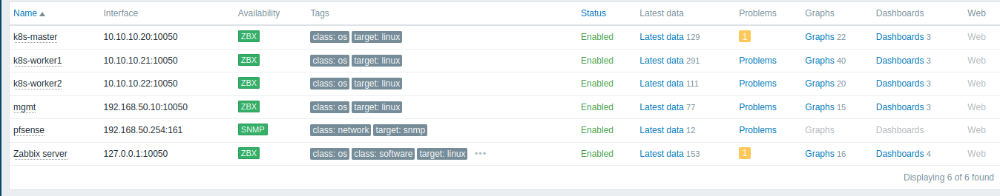

# Phase 05 — Zabbix Agent2 Deployment Across Monitored Hosts

This phase covers installing Zabbix agent2 on `k8s-master`, `k8s-worker1`, `k8s-worker2` and `mgmt`, narrowing the broad `HOST_ZABBIX → Any` firewall rule to precise, purpose-specific rules, and a deliberate decision to leave UFW disabled on the Kubernetes nodes. **After this phase, every planned host is actively monitored**, closing the project's main functional goal.

---

## Narrowing the `HOST_ZABBIX → Any` Rule

Before installing any agents, the same least-privilege principle applied to the `HOST_MGMT` rule in [Phase 04](troubleshooting/pfsense-broad-rule-self-traffic-leak.md) was deliberately applied to the existing broad `HOST_ZABBIX` rule (originally created in Phase 01 for general internet access).

**Removed:**
```
HOST_ZABBIX | *   | → | * | : | *
```

**Replaced with two precise rules:**

```
1. Protocol: TCP/UDP | Source: HOST_ZABBIX | Destination: any | Port: 80, 443, 53
   Description: "Zabbix server internet access (apt, package repos, DNS)"

2. Protocol: TCP | Source: HOST_ZABBIX | Destination: GRP_K8S_NODES | Port: 10050
   Description: "Zabbix server agent2 polling - k8s nodes"
```

A network-negation approach (`Destination: !OUTSIDE net`) was considered for the internet-access rule, to precisely exclude local traffic, but rejected as unnecessary complexity — restricting by port (80/443/53) already narrows the rule sufficiently without introducing a negated destination in the pfSense UI.

**Scope of this change:** only the `HOST_ZABBIX` rule, created within `zabbix-noc-lab`, was narrowed. The analogous, still-broad `HOST_MGMT * → * : *` rule from `k8s-cilium-lab` was deliberately left untouched — it belongs to a different repository's scope, despite the structural similarity to the Phase 04 finding.

---

## Agent2 Installation: Kubernetes Nodes

Identical procedure on `k8s-master`, `k8s-worker1` and `k8s-worker2`:

```bash
wget https://repo.zabbix.com/zabbix/7.0/ubuntu/pool/main/z/zabbix-release/zabbix-release_latest_7.0+ubuntu24.04_all.deb
sudo dpkg -i zabbix-release_latest_7.0+ubuntu24.04_all.deb
sudo apt update
sudo apt install zabbix-agent2 -y
```

`/etc/zabbix/zabbix_agent2.conf` — passive mode, chosen deliberately over active mode, consistent with the port-10050 firewall rule already planned back in Phase 00:

```
Server=192.168.50.20
Hostname=<k8s-master | k8s-worker1 | k8s-worker2>
```

`ServerActive` was left commented out.

```bash
sudo systemctl restart zabbix-agent2
sudo systemctl enable zabbix-agent2
```

---

## Deliberate Decision: UFW Left Disabled on Kubernetes Nodes

Before adding a UFW rule for port 10050 on `k8s-worker1`, `ss -tulnp` was run to check what the node already exposed. This revealed that the node serves several critical cluster ports on `0.0.0.0` — kubelet (`10250`), Cilium VXLAN (`8472/UDP`), and Cilium health checks (`4240`/`4244`).

### Incident on `k8s-master`

During the same review, `sudo ufw enable` was run on `k8s-master` — which had UFW `inactive` — **before fully confirming the consequences**. With only SSH and port 10050 permitted, the control-plane node (also serving `kube-apiserver:6443`, `etcd:2379/2380`, `kube-scheduler`, and `kube-controller-manager`) was left with `deny incoming` on every other cluster port for several minutes.

`kubectl get nodes` and `kubectl get pods -A` were checked during this window: all nodes showed `Ready` and all pods showed `Running` — **no visible failure occurred**, most likely because UFW/conntrack does not retroactively drop already-established connections, and no cluster service happened to restart during that window. This is treated as **"no failure was observed," not "confirmed safe"** — the risk of losing cluster connectivity on any service restart (kubelet, cilium-agent, etcd) remained real for the entire duration.

**Corrective action:** `sudo ufw disable` on `k8s-master`, immediately upon recognising the risk. `kubectl get nodes` / `get pods -A` were re-checked afterwards and confirmed the cluster was fully healthy.

**Final decision for the whole phase: UFW remains disabled on `k8s-master`, `k8s-worker1` and `k8s-worker2`.** Access to port 10050 on these three nodes is secured exclusively via the pfSense rule (`HOST_ZABBIX → GRP_K8S_NODES : 10050`, above). See [Troubleshooting: UFW Risk Assessment on Kubernetes Nodes](troubleshooting/ufw-kubernetes-node-risk-assessment.md) for the full incident write-up and rationale.

---

## Verification: Kubernetes Nodes

```
$ zabbix_get -s 10.10.10.20 -p 10050 -k agent.ping
1
$ zabbix_get -s 10.10.10.21 -p 10050 -k agent.ping
1
$ zabbix_get -s 10.10.10.22 -p 10050 -k agent.ping
1
```

**Minor procedural incident:** the first `zabbix_get` attempt for `k8s-master` was accidentally run *from `k8s-master` itself*, rather than from `zabbix-server`, returning `ZBX_NOTSUPPORTED: ... agent dropped connection because of access permissions`. This was correctly recognised as expected security behaviour — the source address `10.10.10.20` is not the authorised `192.168.50.20` — rather than a configuration fault. Repeating the test from the correct host (`zabbix-server`) returned `1`. A small, accidental, but valid negative test.

### Hosts Added in Zabbix

| Host | Host group | Interface | Template |
|---|---|---|---|
| `k8s-master` | Kubernetes Nodes | Agent, `10.10.10.20:10050` | Linux by Zabbix agent |
| `k8s-worker1` | Kubernetes Nodes | Agent, `10.10.10.21:10050` | Linux by Zabbix agent |
| `k8s-worker2` | Kubernetes Nodes | Agent, `10.10.10.22:10050` | Linux by Zabbix agent |

---

## Agent2 Installation and Firewall: `mgmt`

Installation and configuration identical to the Kubernetes nodes (`Hostname=mgmt`, passive mode). **Unlike the Kubernetes nodes, UFW was deliberately configured and enabled on `mgmt`** — `mgmt` sits in the OUTSIDE network, outside the Kubernetes cluster, so enabling it carries no risk of disrupting cluster services.

`ss -tulnp` was checked first, confirming WireGuard (`wg0`, listening on `56666/UDP`, connecting outbound to `192.168.50.254:51820`) and a set of local-only services (avahi/mDNS, CUPS, systemd-resolved — all bound to `127.0.0.1` or otherwise irrelevant to inbound traffic).

**Final UFW rules on `mgmt`:**

```bash
sudo ufw allow 56666/udp comment 'WireGuard client (wg0)'
sudo ufw allow from 192.168.50.20 to any port 10050 proto tcp comment 'Zabbix agent2 - zabbix-server only'
sudo ufw enable
```

**No inbound SSH rule was added deliberately** — `mgmt` is never the target of inbound SSH from elsewhere; access to it is local, via the VMware Workstation console, and `mgmt` is only ever the *source* of outbound SSH connections to other lab hosts. `allow outgoing` (UFW's default policy) combined with connection-state tracking (conntrack, `ESTABLISHED`/`RELATED`) is sufficient for outbound SSH and its return traffic, without an explicit inbound rule — confirmed in practice (`ssh zabbix` from `mgmt` continued to work after UFW was enabled).

### Verification

```
$ sudo ufw status verbose
Status: active
Logging: on (low)
Default: deny (incoming), allow (outgoing), disabled (routed)
New profiles: skip

To                         Action      From
--                         ------      ----
56666/udp                  ALLOW IN    Anywhere                   # WireGuard client (wg0)
10050/tcp                  ALLOW IN    192.168.50.20               # Zabbix agent2 - zabbix-server only
56666/udp (v6)             ALLOW IN    Anywhere (v6)               # WireGuard client (wg0)
```

- `wg show` confirmed WireGuard uninterrupted (`latest handshake: 15 seconds ago`).
- `ssh zabbix` from `mgmt` confirmed working correctly after UFW was enabled.

### Host Added in Zabbix

| Host | Host group | Interface | Template |
|---|---|---|---|
| `mgmt` | Management | Agent, `192.168.50.10:10050` | Linux by Zabbix agent |

```
$ zabbix_get -s 192.168.50.10 -p 10050 -k agent.ping
1
```

---

## Additional Issue Found and Fixed: Missing ICMP Rule to pfSense

After narrowing `HOST_ZABBIX → Any` (above), Zabbix raised a **High severity** trigger: *"Generic by SNMP: Unavailable by ICMP ping"* on the `pfsense` host. See [Troubleshooting: Missing ICMP Rule After Narrowing HOST_ZABBIX](troubleshooting/missing-icmp-rule-after-firewall-narrowing.md) for the full diagnosis and fix.

**Fix applied:**

```
Protocol: ICMP | Source: HOST_ZABBIX | Destination: This Firewall (self)
Description: "Allow ICMP from zabbix-server to pfSense (SNMP host availability check)"
```

**Verification:**

```
$ ping -c 4 192.168.50.254
PING 192.168.50.254 (192.168.50.254) 56(84) bytes of data.
64 bytes from 192.168.50.254: icmp_seq=1 ttl=64 time=0.349 ms
64 bytes from 192.168.50.254: icmp_seq=2 ttl=64 time=0.369 ms
64 bytes from 192.168.50.254: icmp_seq=3 ttl=64 time=0.461 ms
64 bytes from 192.168.50.254: icmp_seq=4 ttl=64 time=0.347 ms

--- 192.168.50.254 ping statistics ---
4 packets transmitted, 4 received, 0% packet loss, time 3097ms
rtt min/avg/max/mdev = 0.347/0.381/0.461/0.046 ms
```

The Zabbix trigger cleared automatically on the next check cycle, confirmed by the problem badge disappearing from the Hosts view.

---

## Final State: All Planned Hosts Active



| Host | Interface | Availability | Status |
|---|---|---|---|
| `k8s-master` | `10.10.10.20:10050` | ZBX | Enabled |
| `k8s-worker1` | `10.10.10.21:10050` | ZBX | Enabled |
| `k8s-worker2` | `10.10.10.22:10050` | ZBX | Enabled |
| `mgmt` | `192.168.50.10:10050` | ZBX | Enabled |
| `pfsense` | `192.168.50.254:161` | SNMP | Enabled |
| Zabbix server | `127.0.0.1:10050` | ZBX | Enabled |

Two mild, informational Warning-level triggers remain open, on `k8s-master` and `Zabbix server` (for example, a change in the number of installed packages). These are deliberately deferred to Phase 06 (triggers and dashboards) and do not block closing this phase.

---

## Phase 05 Checkpoint

- All six planned hosts are enabled and reporting in Zabbix, confirmed via the Hosts list (`Displaying 6 of 6 found`).
- The broad `HOST_ZABBIX → Any` rule has been narrowed to two purpose-specific rules (internet access on 80/443/53; agent2 polling to Kubernetes nodes on 10050), following the same least-privilege lesson from Phase 04.
- UFW is deliberately left disabled on `k8s-master`, `k8s-worker1` and `k8s-worker2`, with access to port 10050 secured entirely at the pfSense level — see the linked troubleshooting document for the full risk assessment behind this decision.
- UFW is active on `mgmt`, permitting only WireGuard and Zabbix agent2 polling from `zabbix-server`.
- A missing ICMP rule for `HOST_ZABBIX → pfSense`, surfaced by a Zabbix trigger after the rule narrowing, has been identified and fixed.
- This closes the project's main functional monitoring goal: every planned host is now actively monitored.

See the [Validation](../README.md#validation) section of the README, and [Architecture](architecture.md) for the fully updated firewall rule set and monitored hosts table.
